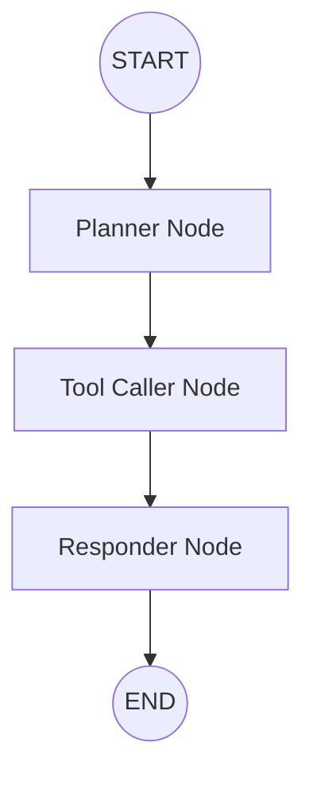

# Academic Research Intelligence Agent

## Overview
The Academic Research Intelligence Agent is an AI-powered tool that enables researchers, clinicians, students, and knowledge workers to rapidly surface and synthesize the most influential academic literature on any topic. 

It autonomously plans and executes multi-source searches across ArXiv, PubMed, and Semantic Scholar, deduplicates results, ranks papers by citation impact, and returns structured summaries of the top findings.

## Architecture
The agent is built using **LangGraph**, utilizing a state machine for its execution flow:



- **Planner**: Extracts search terms from the query.
- **Tool Caller**: (Sprint 0 stub) Will execute search and enrichment tools.
- **Responder**: Generates the final formatted response.

## Setup Instructions

### Prerequisites
- Python 3.11+
- Conda (optional but recommended for environment management)

### 1. Repository Setup
```bash
# Clone the repository
git clone <repo-url>
cd research_agent

# Create conda environment and install dependencies
make setup

# Activate the environment
conda activate research-agent
```

### 2. Configuration
Copy the example environment file and add your API keys:
```bash
cp .env.example .env
```
Edit `.env` and provide your `ANTHROPIC_API_KEY` and `LANGSMITH_API_KEY`.

## Usage
Run the agent using the provided Makefile command:

```bash
# Default query
make run

# Custom query
make run QUERY="CRISPR gene editing"
```

## Sprint Status

| Sprint | Goal | Status |
| :--- | :--- | :--- |
| **Sprint 0** | **Foundation: Repo Setup, Scaffolding, Hello-World Agent** | **Done** |
| Sprint 1 | Core Agent and Tools: ArXiv + Semantic Scholar | **Done** |
| Sprint 2 | Multi-Source and Planning: PubMed + Parallel Execution | Planned |
| Sprint 3 | Summarization and Research Brief | Planned |
| Sprint 4 | Evaluation Framework | Planned |
| Sprint 5 | Observability, UI, and Polish | Planned |

## Development
```bash
# Lint and format
make lint

# Run type checks
make typecheck

# Run tests
make test
```
